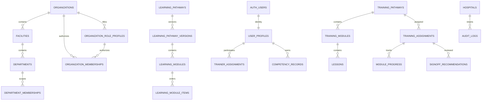

# Supabase database foundation

This foundation is version controlled and is **not automatically applied to a hosted project**. The static Demo Mode and browser sample data remain separate. It models workforce training only: **patient names, records, diagnoses, clinical data, and patient documents are prohibited**.

## Architecture and relationships

All application identifiers are UUIDs and timestamps are `timestamptz` (UTC instants). `auth.users` owns identity; `user_profiles` deliberately contains no password or organisation authorization data. Organisations are the tenant boundary; facilities and departments provide operational scope. `organization_staff_profiles` holds organisation-specific employment data so one identity can belong to multiple organisations. Assignments preserve history, while partial unique indexes prevent duplicate current relationships. Competencies are appendable historical records rather than overwritten certificates. Audit rows are append-only.



## Authorization model

Every application table has RLS enabled and forced. Anonymous access has no policies. Private membership helpers evaluate `auth.uid()` on the server and reject suspended/archived profiles. Organisation Administrators are tenant-bound; Facility Administrators and Department Managers are explicitly assignment-bound; learners see their own records; trainers see compatible, assigned trainees. Correct-answer rows have no authenticated read policy. Trainers can recommend but Management alone can decide. Audit logs have no client mutation policy and an append-only trigger. A final-active-administrator trigger prevents suspension, archive, deletion, or demotion. See [multi-organization-foundation.md](multi-organization-foundation.md) for the complete Phase 1 model.

The additive Canvas-style learning layer is documented in [shared-domain-model.md](shared-domain-model.md). The existing `training_*` tables remain authoritative until the later verified migration phase; the shared-domain migration does not move production assignments or progress.

PostgreSQL base privileges are intentionally separate from row authorization. The `authenticated` API role receives schema usage and only the table operations for which an RLS policy exists; RLS then decides which rows each request may affect. The migration explicitly withholds all protected-table access from `anon`, all browser access to knowledge-answer options, and every authenticated audit-log mutation. Projects created with automatic table exposure disabled therefore work without relying on permissive Dashboard defaults.

The role helpers use `SECURITY DEFINER` only to avoid recursive membership-policy evaluation. They use an empty search path, qualified objects, and authenticated-only execution. The competency expiry function requires cross-tenant scheduler access and is executable only by `service_role`; it must run in trusted server infrastructure, never a browser.

## Local setup

Prerequisites: Docker and the [Supabase CLI](https://supabase.com/docs/guides/local-development/cli/getting-started).

```sh
supabase start
supabase db reset       # migrations, then development-only seed
supabase test db        # pgTAP tests in supabase/tests
```

`supabase db reset` safely rebuilds the local database. `seed.sql` uses clearly synthetic `.test` users and two development tenants for isolation tests. Supabase automatically runs it locally because `config.toml` enables seeding. **Never run the seed against staging or production.** Create further ordered migrations; do not make undocumented Dashboard schema edits.

Copy `.env.example` to an ignored `.env` only when client integration begins. `SUPABASE_URL` and `SUPABASE_ANON_KEY` are public project configuration, not authorization secrets; RLS remains authoritative. Never put a service-role key, password, token, or connection string in browser configuration or Git.

## Future application connection

`src/supabase-client.js` is a non-imported adapter placeholder and `src/database-service.js` is the boundary the UI can later consume. Keep the current demo store until an incremental migration is approved. A future session service should obtain Supabase Auth session state, load profile/membership roles from RLS-protected database queries, and treat server results—not local storage—as authority. Open sign-up stays disabled; staff onboarding requires an approved invitation flow. Privileged invitation, approval, auditing, and scoring operations should be protected server functions or server endpoints. Never use the service-role key in browser code.

## Production limitations

This schema is preparation, not production readiness. Deployment still requires:

- explicitly linking and migrating the actual project (never as part of local development);
- secure invitation and account-recovery flows and server-side privileged operations;
- Management multi-factor authentication;
- production backup/recovery configuration and rehearsals;
- monitoring, security alerts, and rate limiting;
- an approved email provider;
- privacy/security review and penetration testing;
- Australian legal and hospital-governance review; and
- a decision on the appropriate Supabase production plan and contractual requirements.

Private buckets now exist for organisation branding, training content and competency evidence. The first object-path segment must be the organisation UUID and Storage RLS checks active organisation authorization. Large media belongs in object storage, not PostgreSQL. Patient-document storage is out of scope and prohibited.
