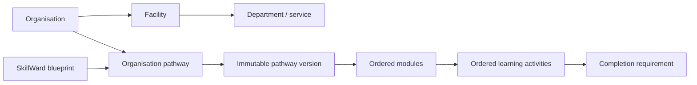

# Shared learning and competency domain model

## Pull request 1 boundary

This is the additive database foundation for the staged Canvas-style transformation. It does **not** switch the live application away from `training_pathways`, `training_modules`, `lessons`, `training_assignments`, or `module_progress`. The public site, authentication, Guided Demo, Hospital content, dashboards, department selection, invitations, password recovery, and production records continue to use their current paths.

The future cut-over is deliberately reserved for the verified migration phase. Until then, the two models coexist and the legacy model remains authoritative for existing assignments and progress.

## Hierarchy



`learning_pathways` is the shared identity:

- SkillWard blueprints have `owner_type = 'SkillWard'` and no `organization_id`.
- Organisation copies have `owner_type = 'Organization'`, a required `organization_id`, and may reference a SkillWard blueprint.
- `learning_pathway_versions` contains lifecycle, objectives, renewal rules, blueprint lineage, locks, and review/publication metadata.
- `learning_modules` and `learning_module_items` carry the same ownership key and are validated against their parent version in PostgreSQL.
- A current version must be a published version of the same pathway.
- Published or retired version content cannot be edited, deleted, or appended to. A retirement may change lifecycle metadata only. Future edits require a new draft.

The initial activity types cover pages, files, videos, links, downloads, quizzes, evidence submissions, practical observations, and management approval. The authoring and assessment records behind those item types arrive in the next focused pull requests.

## Stable permissions and sector titles

`permission_roles` defines eight stable access boundaries:

| Access role | Purpose |
| --- | --- |
| SkillWard Super Administrator | Platform and blueprint control |
| Organisation Administrator | Organisation configuration and delegation |
| Facility Administrator | Assigned-facility administration |
| Educator / Content Administrator | Organisation content authoring |
| Manager | Assignment and final approval |
| Trainer / Assessor | Practical assessment and recommendation |
| Worker | Assigned learning and own evidence |
| Read-only Auditor | Scoped compliance and audit reading |

`organization_role_profiles` maps those stable roles to an organisation's display and sector titles. Existing PCA, Cleaner, Support Worker, PCA Trainer, Cleaner Trainer, Department Manager, and administrator memberships retain their current `role` value, while `role_profile_id` maps them to Worker, Trainer, Manager, or the relevant administrator permission role. This preserves current routing while allowing later Aged Care and Disability Support titles without multiplying authorization policies.

New organisations automatically receive one default profile for each tenant role. A membership cannot reference a role profile belonging to another organisation. Users still cannot modify their own authorization.

## Tenant and publication security

- Every organisation-owned new row contains `organization_id`.
- PostgreSQL validation triggers reject a pathway, version, module, prerequisite, or item whose ownership differs from its parent.
- `organization_id` uses null-safe immutability protection. A global blueprint cannot be converted into an organisation record, or vice versa.
- All seven new exposed tables enable and force RLS.
- Anonymous users receive no protected-table privileges.
- Stable permission-role checks are evaluated from active database memberships and role profiles, never editable Auth metadata.
- Organisation members can read only published versions in their organisations. Educators and organisation administrators can also read drafts in their own organisation.
- Only SkillWard administrators can manage global blueprints.
- Cross-organisation writes fail even when a caller supplies a syntactically valid foreign UUID.
- `content_audit_events` is trigger-written and append-only. Browser roles receive no insert, update, or delete privilege.
- Legacy ID mappings and migration count snapshots are kept in the non-exposed `private` schema.

## Compatibility and future phases

No legacy content is copied in this pull request. `private.legacy_content_mappings` is intentionally empty and ready to record an explicit source-to-target UUID mapping later. That later migration will record before/after counts in `private.migration_validation_counts`, preserve historical version links, verify saved routes and assignments, and only then consider a read cut-over.

The next pull requests build on this foundation:

1. Blueprint copying, locks, comparisons, review and authoring.
2. Assignment, requirements, quizzes, evidence, observations, approval and competency issuance.
3. Aged Care and Disability Support sample environments.
4. Unified Guided Demo.
5. Role dashboards, navigation, matrix and reports.
6. Verified legacy migration, security testing and production cut-over.

## Migration verification

Run against a local or isolated Supabase database:

```sh
supabase db reset
supabase test db
npm test
npm run build
```

`shared_domain_model.test.sql` verifies RLS and grants, stable role mapping, worker/educator/administrator/auditor/platform boundaries, global blueprint visibility, cross-organisation denial, publication immutability, audit visibility, and unchanged legacy fixture counts.

## Known limitations

- The live UI does not read or write the new learning tables yet.
- Blueprint copy/synchronisation, field locks and diff review arrive in pull request 2.
- Assessment instruments, outcomes, rubrics, submissions and workflow state arrive in pull requests 2 and 3.
- Sector sample content and official-source metadata arrive in pull request 4.
- Legacy mapping tables remain empty until the verified migration phase.
- Production migration still requires a backup, restore rehearsal, isolated deployment rehearsal, migration-count capture and explicit approval.

